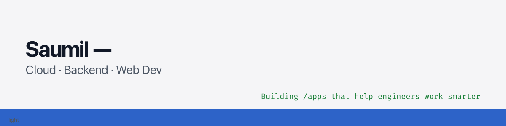

<!--
  GitHub Profile README for Saumil — Final Merged Edition
-->

<!-- Light/Dark Auto Banner -->

  <picture>
    <source srcset="assets/profile-banner-dark.png" media="(prefers-color-scheme: dark)" />
    <source srcset="assets/profile-banner-light.png" media="(prefers-color-scheme: light), (prefers-color-scheme: no-preference)" />
    
  </picture>

<h1 align="center">Hi 👋 I’m Saumil</h1>

  <a href="https://saumilp.github.io" target="_blank">🌐 Portfolio</a>

  

---

I’m a software engineering enthusiast who enjoys building practical tools, backends, and small utilities that make software engineers’ lives easier.  
Most days I’m exploring new ideas in cloud, backend, and web-dev — and picking up something new while solving problems.

---

## 🔧 Tech Stack

<!-- key languages -->

 

<!-- backend / infra -->

 

<!-- tools -->

---

## 🧩 Skills Matrix

| Category | Skills |
|---------|--------|
| **Languages** | Java, Rust, Python, TypeScript |
| **Backend** | Spring Boot, REST APIs, Microservices, Messaging |
| **Cloud & Infra** | AWS, Docker, Kubernetes, CI/CD |
| **Databases** | PostgreSQL, Redis, MySQL, MongoDB |
| **Frontend (basic)** | React, TypeScript tooling |
| **Dev Tools** | Git, GitHub Actions, VS Code |
| **Architectural Skills** | Design patterns, modular design, scalable backend patterns |

---

## 📂 Selected Projects

- **[design-patterns](https://github.com/SaumilP/design-patterns)**  
  A curated, production-oriented collection of **classic software design patterns implemented in Java**.

- **[Enterprise Spring Patterns & Recipes](https://github.com/SaumilP/enterprise-spring-patterns-and-recipes)**  
  Hands-on Spring Boot projects exploring practical Java backend patterns and features.

- **[mastodon-toot-client](https://github.com/SaumilP/mastodon-toot-client)**  
  A small, production-minded Rust CLI tool that reads dataset file, selects item, renders message and posts to a Mastodon instance.

- **[gh-yule-gitlog-rs](https://github.com/SaumilP/gh-yule-gitlog-rs)**  
  A Github CLI extension that turns your terminal into a festive, animated Yule log based on your Github activity!

- **[rust-learning-lab](https://github.com/SaumilP/rust-learning-lab)**
  Learn Rust from scratch with hands-on examples — designed for C/C++/Java/Python developers moving into safe systems programming.

- **[Draw.io Architecture Libraries](https://github.com/SaumilP/drawio_libraries)**  
  Draw.io architecture libraries catalog for engineers and architects - to be able to create **clear, consistent, and review-ready software architecture diagrams**.

- **[Spring Boot Starters](https://github.com/SaumilP/spring-boot-starters)**  
  Platform-grade Spring Boot starters for scalable, governed service development.

---

## 📈 GitHub Stats

  

  <picture>
    <source 
      srcset="https://github-readme-activity-graph.vercel.app/graph?username=SaumilP&theme=tokyo-night&hide_border=true" 
      media="(prefers-color-scheme: dark)" />
    <source 
      srcset="https://github-readme-activity-graph.vercel.app/graph?username=SaumilP&theme=github-light&hide_border=true" 
      media="(prefers-color-scheme: light), (prefers-color-scheme: no-preference)" />
    
  </picture>

---

## 📊 Engineering Snapshot

---

## 📝 Learning Notes (Click to expand)

View ongoing notes & experiments

### 🌱 Currently Learning
- Rust async patterns  
- Advanced Spring Boot modular architecture  
- Clean Architecture & DDD  
- GitHub Actions automations  
- Container networking & distributed systems basics  

### 🧪 Experiments
- CLI tools in Rust  
- Simple bots & automation scripts  
- Local-first workflows  
- Improving backend performance patterns  

---

## 🖥️ Now Operating On… (Developer Dashboard)

<!-- DASHBOARD:START -->
| Metric | Value |
|--------|-------|
| 🚀 Repositories (public) | 63 |
| 🌱 Recent Activity | DeleteEvent on SaumilP/design-patterns (2026-02-01) |
| 🧪 Last Updated | 2026-02-02 01:11 UTC |
<!-- DASHBOARD:END -->

---

## 📫 Connect

  

