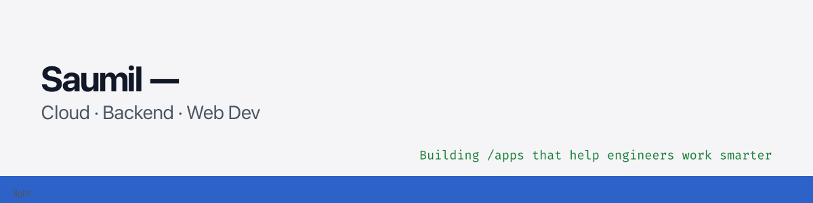

<!--
  GitHub Profile README for Saumil — Final Merged Edition
-->

<!-- Light/Dark Auto Banner -->

  <picture>
    <source srcset="assets/profile-banner-dark.png" media="(prefers-color-scheme: dark)" />
    <source srcset="assets/profile-banner-light.png" media="(prefers-color-scheme: light), (prefers-color-scheme: no-preference)" />
    
  </picture>

<h1 align="center">Hi 👋 I’m Saumil</h1>

  <a href="https://saumilp.github.io" target="_blank">🌐 Portfolio</a>

  

---

I’m a software engineering enthusiast who enjoys building practical tools, backends, and small utilities that make software engineers’ lives easier.  
Most days I’m exploring new ideas in cloud, backend, and web-dev — and picking up something new while solving problems.

---

## 🔧 Tech Stack

<!-- key languages -->

 

<!-- backend / infra -->

 

<!-- tools -->

---

## 🧩 Skills Matrix

| Category | Skills |
|---------|--------|
| **Languages** | Java, Rust, Python, TypeScript |
| **Backend** | Spring Boot, REST APIs, Microservices, Messaging |
| **Cloud & Infra** | AWS, Docker, Kubernetes, CI/CD |
| **Databases** | PostgreSQL, Redis, MySQL, MongoDB |
| **Frontend (basic)** | React, TypeScript tooling |
| **Dev Tools** | Git, GitHub Actions, VS Code |
| **Architectural Skills** | Design patterns, modular design, scalable backend patterns |

---

## 📂 Selected Projects

A compact, GitHub-render-safe portfolio grid. Tags use `<kbd>` so they look good in both **light** and **dark** mode.

<table width="100%">
<tr>

<td width="33%" valign="top">

<a href="https://github.com/SaumilP/design-patterns"><b style="font-size:16px;">🧩 design-patterns</b></a> 
<kbd>Architecture</kbd> <kbd>Java</kbd> <kbd>Patterns</kbd>

A production-oriented catalog of classic design patterns with enterprise-ready structure and extensibility guidance.

</td>

<td width="33%" valign="top">

<a href="https://github.com/SaumilP/enterprise-spring-patterns-and-recipes"><b style="font-size:16px;">☕ Spring Patterns & Recipes</b></a> 
<kbd>Architecture</kbd> <kbd>Spring Boot</kbd> <kbd>Platform</kbd>

Hands-on backend patterns for resilience, modular design, observability, and production-grade integration strategies.

</td>

<td width="33%" valign="top">

<a href="https://github.com/SaumilP/spring-boot-starters"><b style="font-size:16px;">🏗️ Spring Boot Starters</b></a> 
<kbd>Governance</kbd> <kbd>Java</kbd> <kbd>Standards</kbd>

Platform-grade starters to standardize security, telemetry, error handling, and service scaffolding.

</td>

</tr>
<tr>

<td width="33%" valign="top">

<a href="https://github.com/SaumilP/mastodon-toot-client"><b style="font-size:16px;">🦀 mastodon-toot-client</b></a> 
<kbd>Tooling</kbd> <kbd>Rust</kbd> <kbd>CLI</kbd>

Dataset-driven automation CLI that renders dynamic content and publishes posts to Mastodon via API orchestration.

</td>

<td width="33%" valign="top">

<a href="https://github.com/SaumilP/gh-yule-gitlog-rs"><b style="font-size:16px;">🎄 gh-yule-gitlog-rs</b></a> 
<kbd>Tooling</kbd> <kbd>Rust</kbd> <kbd>gh-ext</kbd>

A GitHub CLI extension that turns repository activity into a festive, animated terminal experience.

</td>

<td width="33%" valign="top">

<a href="https://github.com/SaumilP/changelog-gen"><b style="font-size:16px;">📝 changelog-gen</b></a> 
<kbd>Release Engineering</kbd> <kbd>Rust</kbd> <kbd>SemVer</kbd>

Changelog & release-notes generator with Conventional Commits, GitHub enrichment, templating, and SemVer workflows.

</td>

</tr>
<tr>

<td width="33%" valign="top">

<a href="https://github.com/SaumilP/rust-learning-lab"><b style="font-size:16px;">🧪 rust-learning-lab</b></a> 
<kbd>Learning</kbd> <kbd>Rust</kbd> <kbd>Hands-on</kbd>

A structured learning lab for engineers moving into safe systems programming, async fundamentals, and performance thinking.

</td>

<td width="33%" valign="top">

<a href="https://github.com/SaumilP/drawio_libraries"><b style="font-size:16px;">📐 Draw.io Architecture Libraries</b></a> 
<kbd>Assets</kbd> <kbd>Architecture</kbd> <kbd>C4</kbd>

Diagram libraries for clear, consistent, review-ready architecture visuals (C4, cloud, and platform components).

</td>

<td width="33%" valign="top">

<b style="font-size:16px;">🚀 Next Flagship</b> 
<kbd>Platform</kbd> <kbd>Cloud-Native</kbd> <kbd>Reliability</kbd>

Upcoming modular platform showcasing modern architecture, observability, and deployment governance.

</td>

</tr>
</table>

---
## 📈 GitHub Stats

  

  <picture>
    <source 
      srcset="https://github-readme-activity-graph.vercel.app/graph?username=SaumilP&theme=tokyo-night&hide_border=true" 
      media="(prefers-color-scheme: dark)" />
    <source 
      srcset="https://github-readme-activity-graph.vercel.app/graph?username=SaumilP&theme=github-light&hide_border=true" 
      media="(prefers-color-scheme: light), (prefers-color-scheme: no-preference)" />
    
  </picture>

---

## 📊 Engineering Snapshot

<!-- Weekly snapshots (served as static files from gh-stats) -->
<picture>
  <source srcset="https://raw.githubusercontent.com/SaumilP/gh-stats/refs/heads/main/public/cards/stats-dark.svg" media="(prefers-color-scheme: dark)" />
  
</picture>

<picture>
  <source srcset="https://raw.githubusercontent.com/SaumilP/gh-stats/refs/heads/main/public/cards/languages-dark.svg" media="(prefers-color-scheme: dark)" />
  
</picture>

 

<picture>
  <source srcset="https://raw.githubusercontent.com/SaumilP/gh-stats/refs/heads/main/public/cards/repos-dark.svg" media="(prefers-color-scheme: dark)" />
  
</picture>

<picture>
  <source srcset="https://raw.githubusercontent.com/SaumilP/gh-stats/refs/heads/main/public/cards/streak-dark.svg" media="(prefers-color-scheme: dark)" />
  
</picture>

---

## 📝 Learning Notes (Click to expand)

View ongoing notes & experiments

### 🌱 Currently Learning
- Rust async patterns  
- Advanced Spring Boot modular architecture  
- Clean Architecture & DDD  
- GitHub Actions automations  
- Container networking & distributed systems basics  

### 🧪 Experiments
- CLI tools in Rust  
- Simple bots & automation scripts  
- Local-first workflows  
- Improving backend performance patterns  

---

## 🖥️ Now Operating On… (Developer Dashboard)

<!-- DASHBOARD:START -->
| Metric | Value |
|--------|-------|
| 🚀 Repositories (public) | 66 |
| 🌱 Recent Activity | PushEvent on SaumilP/gh-stats (2026-03-15) |
| 🧪 Last Updated | 2026-03-30 01:23 UTC |
<!-- DASHBOARD:END -->

---

## 📫 Connect

  

