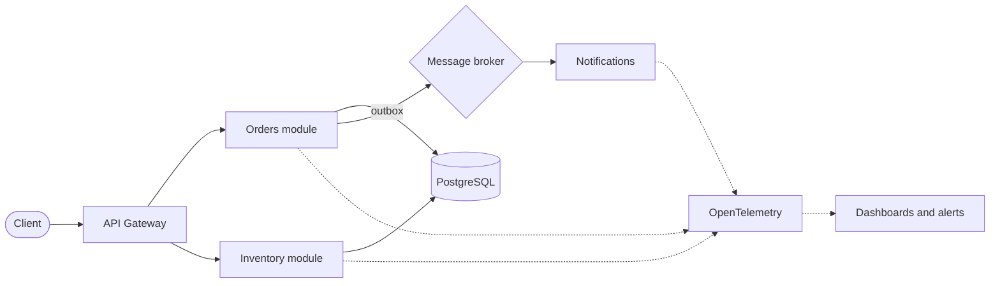

<!--
  GitHub Profile README for Saumil
  Positioning: systems designer (software architecture by day) who stays hands-on after hours.
  Generated pieces: assets/profile-banner-*.svg (scripts/generate-banners.js),
  assets/cards/*.svg (scripts/generate-cards.js), DASHBOARD block (scripts/update-dashboard.js).
-->

  <picture>
    <source srcset="assets/profile-banner-dark.svg" media="(prefers-color-scheme: dark)" />
    <source srcset="assets/profile-banner-light.svg" media="(prefers-color-scheme: light), (prefers-color-scheme: no-preference)" />
    
  </picture>

  

  
  
  

I'm a systems designer who stays hands-on. By day I work in software architecture, designing systems and setting standards; after hours I build reference implementations and tools so my decisions stay grounded in working code.

| When | What I do |
|------|-----------|
| **Day job** | Designing systems, recording decisions, setting standards, reviewing trade-offs. |
| **After hours** | Reference implementations, patterns and Rust tooling. Everything on this profile is personal-time work, built to keep my judgment sharp. |

---

## What I focus on

| Area | What it looks like in practice |
|------|--------------------------------|
| **Service design and boundaries** | Domain-driven design, modular monoliths before microservices, clear ownership and contracts |
| **Resilience and observability** | Timeouts, retries and backpressure designed up front; traces, metrics and logs treated as part of the design |
| **API and integration design** | REST contracts, messaging, idempotency, versioning that does not break consumers |
| **Platform and governance** | Shared starters, golden paths, CI/CD standards so teams spend their effort on the domain |

  Day to day:
  
  
  
  
  
  
  
  
  
  
  

---

## How I design

1. **Start from the boundary, not the framework.** Where responsibility ends matters more than which library sits inside it.
2. **Write the decision down.** Context, options considered, and what we gave up. A short ADR beats a long memory.
3. **Design for failure first.** Decide what happens when a dependency is slow or down before adding the feature.
4. **Standardise the boring parts.** Starters and golden paths remove repeated decisions so the interesting ones get attention.
5. **Prefer decisions that are cheap to reverse.** When unsure, pick the option that is easiest to change later.

---

## Flagship: a reference platform for testing design decisions

> **Status: in progress.** The design below is the target. Nothing here is shipped yet, and each decision is marked *proposed* until the ADR is written and the code backs it up.

A place to prototype architectural decisions with working code before relying on them. It applies the principles above in a modular service built with my own [Spring Boot starters](https://github.com/SaumilP/spring-boot-starters), documented with [C4 diagrams](https://github.com/SaumilP/drawio_libraries), and run with observability and deployment governance from day one.


```mermaid
flowchart LR
    client([Client]) --> gw[API Gateway]
    gw --> orders[Orders module]
    gw --> inventory[Inventory module]
    orders --> pg[(PostgreSQL)]
    inventory --> pg
    orders -- outbox --> broker{Message broker}
    broker --> notify[Notifications]
    orders -.-> otel[OpenTelemetry]
    inventory -.-> otel
    notify -.-> otel
    otel -.-> dash[Dashboards and alerts]
```

| ADR | Decision | Question it answers | Status |
|-----|----------|---------------------|--------|
| 001 | Modular monolith first, split later | When is a service boundary worth a network hop? | Proposed |
| 002 | Transactional outbox for events | How do we publish events without losing or duplicating them? | Proposed |
| 003 | OpenTelemetry through a shared starter | How do teams get consistent traces and metrics for free? | Proposed |
| 004 | Policy checks in the deployment pipeline | How is governance enforced without slowing delivery? | Proposed |

**Planned artifacts:** C4 context and container diagrams, the four ADRs above, failure-mode notes (what breaks and how it degrades), and load-test results.

---

## Reference architecture and patterns

Worked examples of decisions I would make in practice, kept runnable and documented. Start with <a href="https://github.com/SaumilP/design-patterns">design-patterns</a> for decisions in code and <a href="https://github.com/SaumilP/drawio_libraries">drawio_libraries</a> for diagrams.

<table>
<tr>
<td width="50%" align="center" valign="top">
<a href="https://github.com/SaumilP/design-patterns"><picture>
  <source media="(prefers-color-scheme: dark)" srcset="assets/cards/pin-design-patterns-dark.svg" />
  
</picture></a>
</td>
<td width="50%" align="center" valign="top">
<a href="https://github.com/SaumilP/enterprise-spring-patterns-and-recipes"><picture>
  <source media="(prefers-color-scheme: dark)" srcset="assets/cards/pin-enterprise-spring-patterns-and-recipes-dark.svg" />
  
</picture></a>
</td>
</tr>
<tr>
<td width="50%" align="center" valign="top">
<a href="https://github.com/SaumilP/spring-boot-starters"><picture>
  <source media="(prefers-color-scheme: dark)" srcset="assets/cards/pin-spring-boot-starters-dark.svg" />
  
</picture></a>
</td>
<td width="50%" align="center" valign="top">
<a href="https://github.com/SaumilP/drawio_libraries"><picture>
  <source media="(prefers-color-scheme: dark)" srcset="assets/cards/pin-drawio_libraries-dark.svg" />
  
</picture></a>
</td>
</tr>
</table>

## Hands-on builds

Tools I build to stay close to the code: CLIs and automation, mostly in Rust.

<table>
<tr>
<td width="50%" align="center" valign="top">
<a href="https://github.com/SaumilP/mastodon-toot-client"><picture>
  <source media="(prefers-color-scheme: dark)" srcset="assets/cards/pin-mastodon-toot-client-dark.svg" />
  
</picture></a>
</td>
<td width="50%" align="center" valign="top">
<a href="https://github.com/SaumilP/gh-yule-gitlog-rs"><picture>
  <source media="(prefers-color-scheme: dark)" srcset="assets/cards/pin-gh-yule-gitlog-rs-dark.svg" />
  
</picture></a>
</td>
</tr>
</table>

  More: <a href="https://github.com/SaumilP/changeloggen-cli">changeloggen-cli</a> ·
  <a href="https://github.com/SaumilP/rust-learning-lab">rust-learning-lab</a> ·
  <a href="https://github.com/SaumilP?tab=repositories">all repositories</a>

---

## Activity

<table>
<tr>
<td width="50%" align="center" valign="top">
<picture>
  <source media="(prefers-color-scheme: dark)" srcset="assets/cards/stats-dark.svg" />
  
</picture>
</td>
<td width="50%" align="center" valign="top">
<picture>
  <source media="(prefers-color-scheme: dark)" srcset="assets/cards/languages-dark.svg" />
  
</picture>
</td>
</tr>
</table>

<picture>
  <source media="(prefers-color-scheme: dark)" srcset="assets/cards/impact-dark.svg" />
  
</picture>

Cards come from <a href="https://gh-stats-plum-five.vercel.app/">gh-stats</a> and are rebuilt weekly.

---

## Currently exploring

<table>
<tr>
<td width="50%" valign="top">

**Design questions I'm testing**
- Context boundaries and aggregates in DDD
- Consistency and messaging trade-offs in distributed systems
- Observability-led design
- Clean Architecture in modular Spring Boot

</td>
<td width="50%" valign="top">

**Engineering I'm practising**
- Rust async patterns
- CLI tools and automation in Rust
- Local-first workflows
- Backend performance patterns

</td>
</tr>
</table>

---

## Developer dashboard

<!-- DASHBOARD:START -->
| Metric | Value |
|--------|-------|
| 🚀 Repositories (public) | 61 |
| 🌱 Recent Activity | DeleteEvent on SaumilP/gh-stats (2026-09-14) |
| 🧪 Last Updated | 2026-10-05 19:18 UTC |
<!-- DASHBOARD:END -->

---

## Connect

  
  

